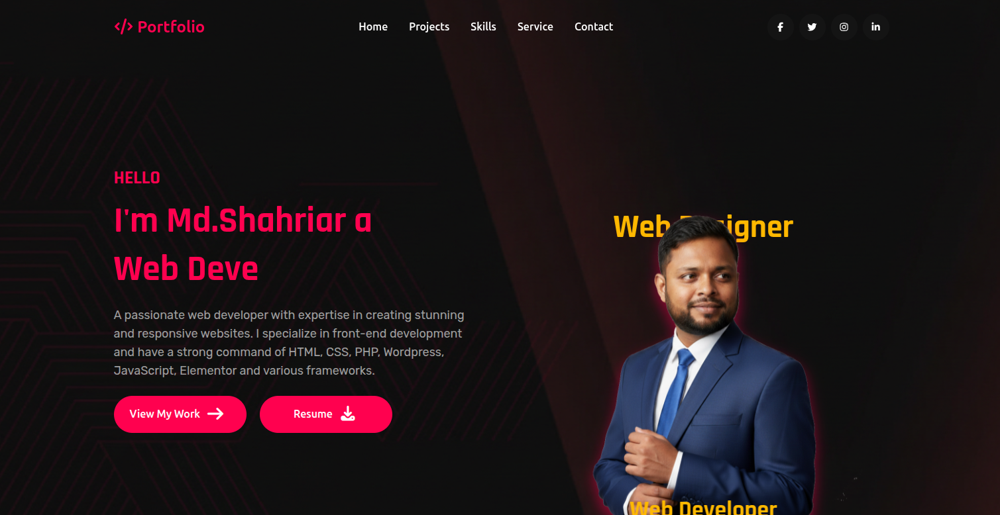

# WPPortfolio - Custom WordPress Theme

 <!-- Optional: Add a screenshot of your theme -->

WPPortfolio is a **custom WordPress theme** designed for portfolio websites. It features a clean, modern, and responsive design to showcase projects, skills, and experiences effectively.  

Live demo: [https://shahriar.free.nf/](https://shahriar.free.nf/)

---

## Features

- Fully responsive layout for desktop, tablet, and mobile
- Hero section with customizable content
- Project showcase with animated tabs
- Smooth scrolling navigation
- Customizable tech stack tags with dynamic colors
- Built with **HTML, CSS, PHP, JavaScript**, and **WordPress** core features
- Ready for personal portfolio or client projects

---

## Installation

1. Download or clone this repository:

```bash
git clone https://github.com/sfsizer/wpportfolio.git

/wp-content/themes/wpportfolio
